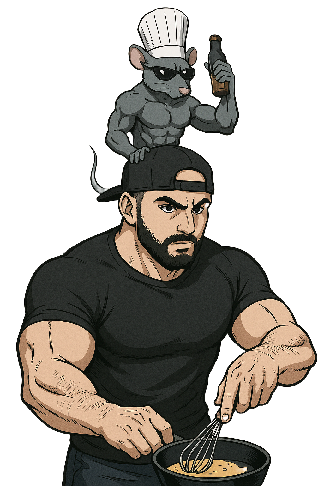
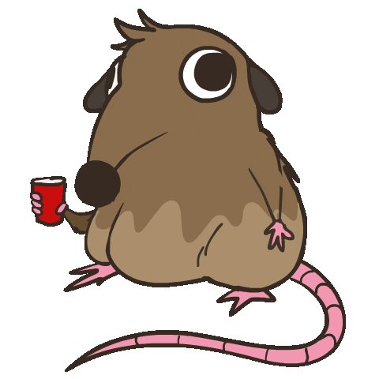
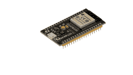
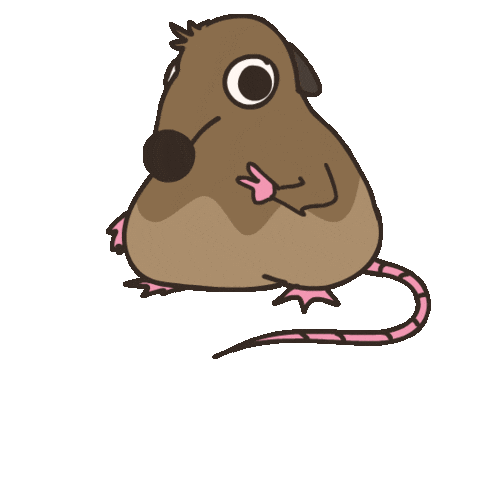

---
theme:
  name: catppuccin-latte
  override:
    footer:
      style: template
      left: "@orhundev"
      right:
        image: assets/rust-global-banner-padded.png
    default:
      colors:
        background: "FFF0EE"
---

<!-- new_lines: 1 -->


<!-- no_footer -->

<!-- end_slide -->


<!-- alignment: center -->

**Deploying Rust UIs to the Terminal**  
_(and to your pocket)_

---

**Orhun Parmaksız**


<!-- end_slide -->

<!-- column_layout: [1, 1] -->

<!-- column: 0 -->



<!-- column: 1 -->

<!-- new_lines: 2 -->

# **Orhun Parmaksız**

🇹🇷 Creator based in **Ankara, Türkiye**

🦀 _Open source, Rust and terminals!_

🐭 **Ratatui**, **Ratzilla**, **git-cliff** ...

📦 **Arch Linux** (btw)

---

`https://github.com/orhun`  
`https://youtube.com/@orhundev`

<!-- end_slide -->

<!-- alignment: center -->

<!-- new_lines: 3 -->

**Imagine a rat.**

<!-- pause -->



<!-- pause -->

_rat wants to download MP3_

<!-- pause -->

_rat goes to ytmp3downloader.cc_

<!-- no_footer -->

<!-- end_slide -->


<!-- pause -->

<!-- jump_to_middle -->


<!-- alignment: center -->

<!-- no_footer -->

<!-- end_slide -->

<!-- no_footer -->

<!-- alignment: center -->

<!-- new_lines: 3 -->

**Imagine a rat.**


<!-- pause -->

_rat wants to find the cheese.txt_

<!-- pause -->

_rat uses file search_

<!-- end_slide -->

<!-- no_footer -->


<!-- pause -->


<!-- pause -->


<!-- pause -->

<!-- jump_to_middle -->


<!-- end_slide -->

<!-- alignment: center -->

<!-- new_lines: 3 -->

<!-- no_footer -->

**Imagine a rat.**


<!-- pause -->

_rat wants to monitor network traffic_

<!-- pause -->

_rat runs a GUI tool_

<!-- pause -->

<!-- end_slide -->

<!-- no_footer -->


<!-- end_slide -->


<!-- alignment: center -->

_rat explodes._

<!-- no_footer -->

<!-- end_slide -->

# Solution?

<!-- pause -->

The terminal.

<!-- pause -->

```bash
$ yt-dlp -f bestaudio --extract-audio --audio-format mp3
```

<!-- pause -->

```bash +exec +acquire_terminal
ig 'fn main' /home/orhun/gh/
```

<!-- pause -->

```sh +exec +acquire_terminal
sudo oryx -i wlp3s0
```

<!-- end_slide -->

<!-- new_lines: 2 -->


<!-- no_footer -->

<!-- end_slide -->


<!-- alignment: center -->

**https://ratatui.rs**

<!-- pause -->

---

> Ratatui is a Rust library for cooking up terminal user interfaces (TUIs).

- Been around since `2023` (fork of `tui-rs`)

- `250+` contributors, hundreds of apps, `8M+` crate downloads

- `tokio-console`, `yazi`, `dioxus-cli`, `atuin`, `gitui` & more

- Used by `Netflix`, `OpenAI`, `OVHcloud` & many more

<!-- end_slide -->

# Example

<!-- alignment: center -->


[](https://github.com/zaghaghi/openapi-tui)

<!-- end_slide -->

# Example

<!-- alignment: center -->


[](https://github.com/MAIF/yozefu)

<!-- pause -->

_Show me!_

<!-- end_slide -->

<!-- alignment: center -->

<!-- new_lines: 1 -->

Easy.

```rust {1-13|2|3|4-6|8-10|1-13} +line_numbers
fn main() -> std::io::Result<()> {
    ratatui::run(|terminal| {
        loop {
            terminal.draw(|frame|
                frame.render_widget("rat", frame.area())
            )?;

            if crossterm::event::read()?.is_key_press() {
                break Ok(());
            }
        }
    })
}
```

<!-- pause -->

_Or cheesy? idk tbh_

<!-- end_slide -->

## Templates

<!-- alignment: center -->

| Template           | Description                            |
| ------------------ | -------------------------------------- |
| Hello World        | A "Hello, World!" example.             |
| Simple             | A simple example.                      |
| Simple Async       | A simple async example.                |
| Event Driven       | An event-driven TUI application.       |
| Event Driven Async | An async event-driven TUI application. |
| Component          | A component-based TUI application.     |

```bash
cargo generate ratatui/templates
```


<!-- end_slide -->

# Architecture (>=v0.30)

<!-- column_layout: [1, 1, 1] -->

<!-- column: 0 -->

### Widgets

- BarChart
- Calendar
- Canvas
- Chart
- Sparkline
- Table
- `impl Widget`
- ...

<!-- column: 1 -->

### Backends

- Crossterm
- Termion
- Termwiz
- `impl Backend`

<!-- column: 2 -->

### Components

ratatui  
├── `ratatui-core`  
├── `ratatui-widgets`  
├── ratatui-crossterm  
├── ratatui-termion  
├── ratatui-termwiz  
└── ratatui-macros

<!-- reset_layout -->

<!-- alignment: center -->


<!-- pause -->

_So why shall we stop here?_

<!-- end_slide -->

<!-- alignment: center -->


Ratatui on `Suzuki Baleno`  
[](https://github.com/thatdevsherry/suzui-rs)

<!-- end_slide -->

<!-- new_lines: 1 -->


<!-- alignment: center -->

Ratatui on `PSP`  
`https://github.com/overdrivenpotato/rust-psp/pull/190`

<!-- end_slide -->


<!-- alignment: center -->

Radioforestrion RPG by `j-g00da` (WIP)

<!-- end_slide -->

<!-- new_lines: 1 -->

We call this:

<!-- pause -->


<!-- alignment: center -->

_https://www.urbandictionary.com/define.php?term=ratatuify_

<!-- pause -->

_But how is it possible?_ 🤔

<!-- end_slide -->

### impl Backend

```rust
pub trait Backend {
    fn draw<'a, I>(&mut self, content: I) -> Result<()>
       where I: Iterator<Item = (u16, u16, &'a Cell)>;
    fn hide_cursor(&mut self) -> Result<()>;
    fn show_cursor(&mut self) -> Result<()>;
    fn get_cursor_position(&mut self) -> Result<Position>;
    fn set_cursor_position<P: Into<Position>>(
        &mut self,
        position: P,
    ) -> Result<()>;
    fn clear(&mut self) -> Result<()>;
    fn size(&self) -> Result<Size>;
    fn window_size(&mut self) -> Result<WindowSize>;
    fn flush(&mut self) -> Result<()>;
    // ...
}
```

<!-- end_slide -->

### Custom Backends

| Repository                          | Description                                 |
| ----------------------------------- | ------------------------------------------- |
| _reubeno_/`ratatui-uefi`            | UEFI                                        |
| _j-g00da_/`mousefood`               | embedded-graphics backend                   |
| _Jesterhearts_/`ratatui-wgpu`       | GPU-accelerated rendering to a buffer       |
| _gold-silver-copper_/`egui_ratatui` | EGUI widget                                 |
| _gold-silver-copper_/`soft_ratatui` | Pure software rendering to arbitrary buffer |
| _cxreiff_/`bevy_ratatui_camera`     | Render Bevy app to the terminal             |
| _orhun_/`ratzilla`                  | Web                                         |


<!-- new_lines: 1 -->

<!-- end_slide -->

Today we will talk about:

<!-- pause -->


<!--alignment: center-->

_mousefood_!

<!-- end_slide -->


<!-- end_slide -->

# Know your hardware!

**ESP32** by Espressif Systems

- Dual-core 32-bit MCU up to 240 MHz with Wi-Fi + Bluetooth
- 520 KB SRAM, supports external flash/PSRAM
- Rich I/O: ADC, DAC, SPI, I²C, UART, PWM, touch sensors

<!-- column_layout: [1, 1, 1]-->

<!-- column: 0 -->

<!-- new_lines:  2-->



<!-- column: 1 -->


<!-- column: 2 -->


<!-- end_slide -->

# Frameworks

<!-- column_layout: [1, 1] -->
<!-- column: 0 -->

## **esp-hal**

- Bare metal (`#![no_std]`)
- Development funded by Espressif

<!-- column: 1 -->

## **esp-idf-hal**

- With `std` support!
- Community effort
- Requires a custom toolchain

<!-- reset_layout -->

<!-- column_layout: [2, 3] -->
<!-- column: 0 -->

<!-- pause -->

## Toolchain

```sh
cargo install espup
espup install
```

```sh
cargo install espflash
```

<!-- column: 1 -->

<!-- pause -->

`.cargo/config.toml`:

```toml
[build]
target = "xtensa-esp32-espidf"

[target.xtensa-esp32-espidf]
linker = "ldproxy"
runner = "espflash flash --monitor"
rustflags = [ "--cfg",  "espidf_time64"]
```

<!-- end_slide -->

```bash +exec +acquire_terminal
esp-generate
```

<!-- alignment: center -->

[](https://github.com/esp-rs/esp-generate)

Built with **Ratatui**! 🐭


<!-- end_slide -->

<!-- new_lines: 2 -->

<!-- alignment: center -->

Soooo, _crab?_

<!-- pause -->


YES!!!!

<!-- pause -->

_What about rat?_

<!-- end_slide -->

### Ratatui + embedded-graphics = **Mousefood**

<!-- column_layout: [4, 3] -->

<!-- column: 0 -->

- Built on `embedded-graphics`
- Custom bitmap font support

<!-- column: 1 -->


<!-- reset_layout -->

```rust {1-9|2|4|5|7-9|1-9}
// Any embedded_graphics DrawTarget
let mut display = MyDrawTarget::new();

let backend = EmbeddedBackend::new(&mut display, EmbeddedBackendConfig::default());
let mut terminal = Terminal::new(backend)?;

loop {
    terminal.draw(...)?;
}
```

<!-- alignment: center -->

`https://github.com/j-g00da/mousefood`

<!-- end_slide -->


<!-- alignment: center -->

[](https://youtu.be/QPjojOuhbe8)  
Ratatui is now `no_std`!

<!-- end_slide -->

<!-- new_lines: 3 -->

<!-- alignment: center -->

# Demo time!


<!-- no_footer -->

<!-- end_slide -->

# Soo, what can we do?

<!-- pause -->


<!-- alignment: center -->

_Powered by Rust, Ratatui and 9 volt battery!_

<!-- end_slide -->


<!-- alignment: center -->

"_A portable and terminal-based guitar training tool_"


```sh +exec
mpv /home/orhun/downloads/tuitar-final.mp4
```

<!-- end_slide -->

<!-- new_lines: 1 -->


<!-- alignment: center -->

[](https://www.youtube.com/live/es48dmNWMVQ)

Live demo at Rust Forge!

<!-- end_slide -->

<!-- column_layout: [5, 8] -->

<!-- column: 0 -->

### impl Widget

```rust
pub struct Fretboard {
    tuning: Vec<Note>,
    style: Style,
}
```

```rust
pub struct FretboardState {
    notes: Vec<Note>
}
```


<!-- column: 1 -->

```rust
impl StatefulWidget for &Fretboard {
    type State = FretboardState;

    fn render(
        self,
        area: Rect,
        buf: &mut Buffer,
        state: &mut Self::State,
    ) {
        for s in self.tuning.iter() {
            // ...
            buf.set_line(
                area.x,
                area.y + i as u16,
                &Line::from(spans),
                area.width,
            );
        }
    }
}
```

<!-- end_slide -->

## Introducing `ratatui-fretboard` widget 🎉

```rust
let fretboard = Fretboard::default();
let mut state = FretboardState::default();
state.set_active_note(Note::A(4));
frame.render_stateful_widget(fretboard, area, &mut state);
```

```
E4 ║─┼───┼───┼───┼───┼─⬤─┼───┼───┼───┼───┼───┼───║
B3 ║─┼───┼───┼───┼───┼───┼───┼───┼───┼───┼─⬤─┼───║
G3 ║─┼───┼───┼───┼───┼───┼───┼───┼───┼───┼───┼───║
D3 ║─┼───┼───┼─•─┼───┼─•─┼───┼─•─┼───┼─•─┼───┼───║
A2 ║─┼───┼───┼───┼───┼───┼───┼───┼───┼───┼───┼───║
E2 ║─┼───┼───┼───┼───┼───┼───┼───┼───┼───┼───┼───║
     1   2   3   4   5   6   7   8   9  10  11  12
```

<!-- alignment: center -->

String names, frets, colors and everything else is customizable.

<!-- end_slide -->


<!-- end_slide -->

```
D0 ║─┼───┼───┼─⬤─┼───┼─⬤─┼───┼───┼───┼─⬤─┼───┼───┼───┼───║
G0 ║─┼───┼───┼───┼─⬤─┼───┼───┼───┼───┼─⬤─┼───┼───┼───┼───║
C0 ║─┼───┼─⬤─┼───┼───┼─⬤─┼───┼─⬤─┼───┼───┼───┼─⬤─┼───┼───║
F0 ║─┼───┼─⬤─┼───┼───┼───┼─⬤─┼───┼───┼───┼───┼─⬤─┼───┼───║
B0 ║─┼───┼───┼───┼───┼─⬤─┼───┼───┼───┼───┼─⬤─┼───┼─•─┼───║
E1 ║─┼───┼───┼─•─┼───┼─⬤─┼───┼─•─┼───┼─•─┼─⬤─┼───┼───┼───║
A1 ║─┼───┼───┼───┼───┼─⬤─┼───┼───┼───┼───┼─⬤─┼───┼─•─┼───║
D2 ║─┼───┼───┼───┼───┼─⬤─┼───┼───┼───┼─✖─┼─⬤─┼───┼─✖─┼───║
G2 ║─┼───┼───┼───┼─✖─┼─⬤─┼───┼─✖─┼───┼───┼───┼───┼───┼───║
C3 ║─┼───┼─✖─┼───┼───┼───┼───┼───┼───┼─✖─┼───┼───┼───┼───║
     1   2   3   4   5   6   7   8   9  10  11  12  13  14
```


<!-- end_slide -->

### Fretboard Tracking


<!-- end_slide -->

### Scale Mode


<!-- end_slide -->

### Random Mode


<!-- end_slide -->

### Song Mode


<!-- end_slide -->

## TUItar

```sh +exec +acquire_terminal
tuitar
```


<!-- alignment: center -->

[](https://github.com/orhun/tuitar)

<!-- end_slide -->

<!-- alignment: center -->

<!-- new_lines: 3 -->

Want more?


_Talk is cheap, show me the cheese._

<!-- end_slide -->


<!-- alignment: center -->

[](https://github.com/intuis/mnyaoo32)

<!-- end_slide -->

<!-- column_layout: [1, 4, 4, 1] -->

<!-- column: 1 -->


<!-- column: 2 -->


<!-- reset_layout -->

<!-- alignment: center -->

[](https://github.com/Julien-cpsn/Phone-OS)

<!-- end_slide -->

### Animations


<!-- alignment: center -->

via [](https://github.com/junkdog/tachyonfx)

<!-- end_slide -->

## Challenges


<!-- end_slide -->

### Bigger screen == bigger problems

```
memory allocation of 153600 bytes failed
...
ili9341::graphics_core::<impl embedded_graphics_core::draw_target::DrawTarget for ili9341::Ili9341>::fill_contiguous
```

- `ST7735`: 160 × 128 ≈ `20 KB` of pixel data.
- `ILI9341`: 240 × 320 ≈ `150 KB` of pixel data.

<!-- pause -->

```rust
esp_alloc::heap_allocator!(size: 160 * 1024);
```

```ini
CONFIG_ESP_MAIN_TASK_STACK_SIZE=16384
```

<!-- end_slide -->


<!-- pause -->

<!-- jump_to_middle -->


<!-- end_slide -->

### Build hell

Random panics / loadprohibited / semaphore asserts with `opt-level` > 1

<!-- pause -->

```toml
[profile.release]
opt-level = 3

[profile.release.package."firmware"]
opt-level = 1

[profile.dev]
debug = true
opt-level = "z"
```

<!-- pause -->

<!-- alignment: center -->

Caused by LLVM optimizations + Xtensa backend bugs + undefined behavior (allocation, alignment, lifetimes, etc.)

<!-- pause -->

i.e. `pain`

<!-- jump_to_middle -->


<!-- end_slide -->

btw you can watch me suffer

<!-- pause -->


<!-- alignment: center -->

<!-- end_slide -->


<!-- end_slide -->


<!-- end_slide -->


<!-- end_slide -->


<!-- end_slide -->


<!-- end_slide -->


<!-- alignment: center -->

[](https://www.youtube.com/@orhundev)

<!-- column_layout: [1, 2, 2, 1 ]-->

<!-- column: 1 -->


<!-- column: 2 -->

<!-- new_lines: 1 -->


<!-- end_slide -->

### Important note!

<!-- pause -->

<!-- alignment: center -->


[](https://github.com/sponsors/orhun)

<!-- end_slide -->

<!-- alignment: center -->

<!-- no_footer -->

# Thank you!



[](https://github.com/orhun)  
[](https://github.com/orhun/tuitar)

---

✨ Slides: [](https://github.com/orhun/rustchinaconf-2025-talk)  
`P.S. I don't have a rat under my hat!`
